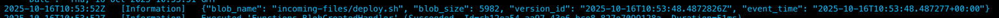

# BlobCreated Azure Function (Python)

## Overview

This project implements an Azure Function in Python that reacts to BlobCreated events from Azure Storage (via Event Grid). The function logs information about each newly created blob:

* blob_name — blob file name
* blob_size — blob size in bytes
* version_id — blob version ID
* event_time — event timestamp

Example log output:

```json
{
  "blob_name": "incoming/data.csv",
  "blob_size": 2048,
  "version_id": "2024-06-18T10:13:50.4052361Z",
  "event_time": "2025-06-22T11:21:45.813Z"
}
```

## Requirements

* Python 3.10+
* Azure CLI
* Azure Functions Core Tools
* Active Azure subscription (`az login`)

## Deployment

1. Make the deployment script executable:

   ```bash
   chmod +x deploy.sh
   ```
2. Run the script:

   ```bash
   ./deploy.sh
   ```

   The script will automatically:

   * Create a Resource Group, Storage Account, and Function App
   * Deploy your Azure Function code
   * Set up an Event Grid subscription for BlobCreated events

## Environment Variables

You can override defaults before running the script or in the .env file:

```bash
RG=my-rg LOC=westeurope SA_NAME=myblobstorage APP_NAME=myfunc
```

## Testing

After deployment, upload any file to the created Storage Account to trigger the function. 
View logs in real-time at the Application Insights -> Logs -> Traces:


## Azure Services Used

* Azure Functions — executes your event handler code
* Event Grid — routes BlobCreated events to the function
* Azure Storage Account — source of blob creation events (versioning enabled)
* Managed Identity — provides secure, keyless access to Azure resources

# Unit Test Ideas for function_app.py

1. Helper Function Tests
   - Validate `_parse_blob_name_from_url` correctly decodes and extracts blob path.
   - Check behavior with leading slashes, URL-encoded characters, and nested folders.

2. Event Grid Subscription Validation
   - Returns HTTP 200 and JSON body `{"validationResponse": "<code>"}` when validation event is received.
   - Handles missing `validationCode` safely without exceptions.

3. BlobCreated Event - Standard Behavior
   - Handles a single valid `BlobCreated` event successfully.
   - Logs JSON with `blob_name`, `blob_size`, `version_id`, and `event_time` fields.

4. Version ID Handling
   - Logs version_id when available from blob properties.
   - Logs null version_id if unavailable or when `get_blob_properties()` raises an exception.

5. Multiple Events in a Single Request
   - Processes and logs each `BlobCreated` event in a batch payload.
   - Returns HTTP 200 overall.

6. Ignored Event Types
   - Ignores non-BlobCreated event types gracefully without crashing.
   - Still returns HTTP 200.

7. Malformed Request Handling
   - Returns HTTP 500 when request body is not valid JSON.
   - Logs appropriate error message.

8. Partial or Missing Fields
   - Handles missing `data.url` or `data.contentLength` safely.
   - Still logs available fields without breaking.

9. BlobClient and Credential Mocking
   - Verifies that `BlobClient.from_blob_url` and `DefaultAzureCredential` are called properly.
   - Ensures correct behavior under mocked Azure SDK components.

10. Logging Verification
   - Confirms all expected fields appear in logs.
   - Verifies JSON log line structure and formatting.